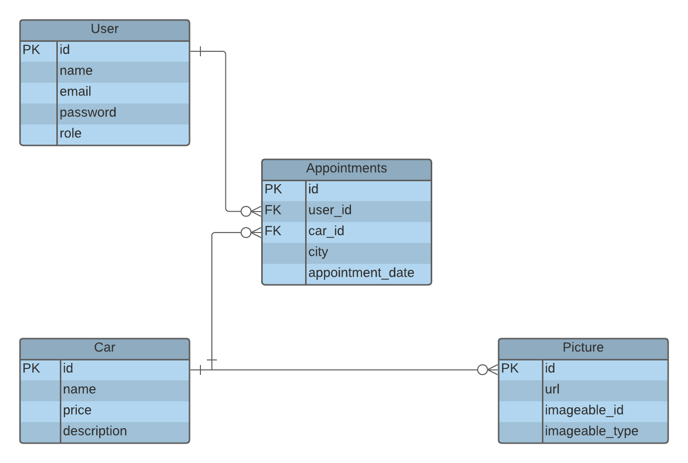

# Muscle Cars API

This API is the backend of [Muscle Cars app](https://github.com/ericmbouwe/musclecars-app).

## Live Demo

Please connect your app by using [this URL](https://musclecars-api.herokuapp.com/)

## Documentation
Please check [the detailed documentation.]() `In progress...`

## Built With

- Ruby on Rails
- RSpec
- Postgresql

## Getting Started

To get a local copy up and running follow these simple example steps.

### Prerequisites

Make sure Node.js is running on your local machine.

## Setup

- Clone this repository
- Open terminal
- Change directory by using `cd musclecars-api`
- Run `bundle install`
- [Setup Postgresql](https://www.howtoforge.com/tutorial/ruby-on-rails-ror-with-postgresql-on-ubuntu-16-04/#step-setting-up-the-postgresql-database-for-rails-development). If you have any problem, please check [this answer](https://serverfault.com/a/248162)

### Usage

- Run `rails server` or `rails s -p port_number` to run in a different port
- Open a browser and go to http://localhost:3000

## Test app

- Clone this repository
- Open terminal
- Change directory by using `cd musclecars-api`
- Run `bundle install`
- [Setup Postgresql](https://www.howtoforge.com/tutorial/ruby-on-rails-ror-with-postgresql-on-ubuntu-16-04/#step-setting-up-the-postgresql-database-for-rails-development). If you have any problem, please check [this answer](https://serverfault.com/a/248162)

### Default: Run all spec files (i.e., those matching spec/**/*_spec.rb)
`$ bundle exec rspec`

### Run all spec files in a single directory (recursively)
`$ bundle exec rspec spec/models`

### Run a single spec file
`$ bundle exec rspec spec/controllers/names_controller_spec.rb`

## Generate model serializers
` rails g serializer model_name `

## Get routes in the browser
` http://localhost:3000/rails/info/routes `

## Clear the server PID file
` kill -9 $(lsof -i tcp:3000 -t) `

## Generate fake password
` BCrypt::Password.create('azerty') `

## Seed the database
` heroku run rails db:seed `

It will create 2 users you can log in with
### email | password
- Admin: er@server.io | azerty
- User: jo@server.io | azerty

# Authors

Reach out to me at one of the following places!

👤 **Eric Mbouwe**

- Website: [ericmbouwe.com](https://ericmbouwe.netlify.app/)
- LinkedIn: [Eric Mbouwe](https://www.linkedin.com/in/ericmbouwe/)
- Github: [@ericmbouwe](https://github.com/ericmbouwe)
- Twitter: [@ericmbouwe](https://twitter.com/ericmbouwe)
- Mail: [ericmbouwe@gmail.com](mailto:ericmbouwe@gmail.com)

## 🤝 Contributing

Contributions, issues, and feature requests are welcome!

Feel free to check the [issues page](https://github.com/ericmbouwe/musclecars-api/issues).

## Show your support

Give a ⭐️ if you like this project!

## Acknowledgments

- [Microverse Inc](https://www.microverse.org/)